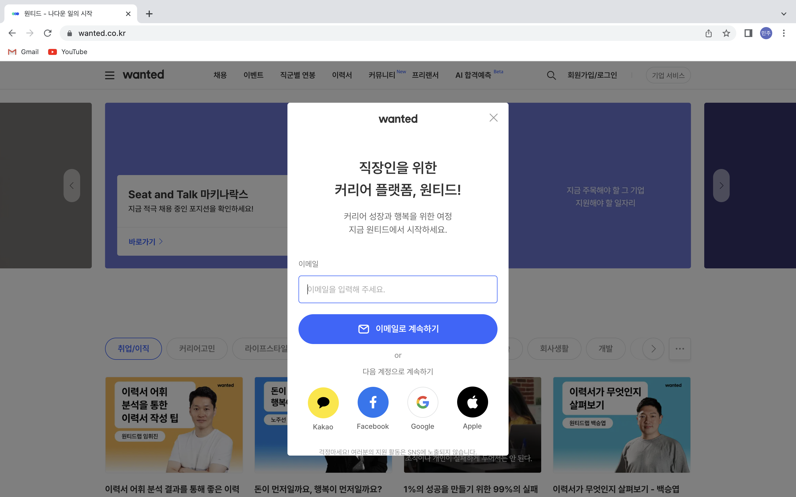
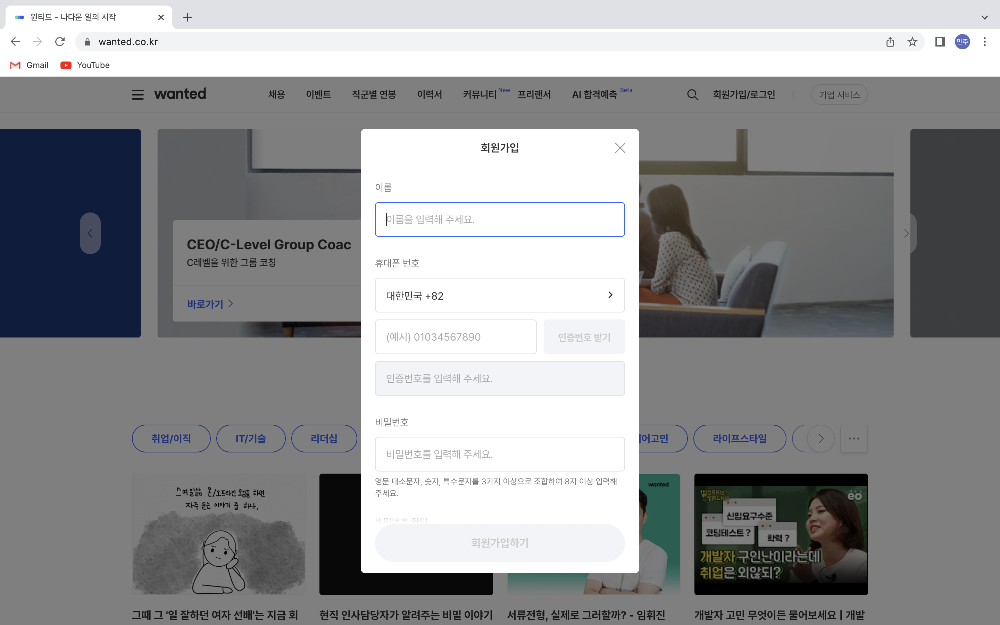
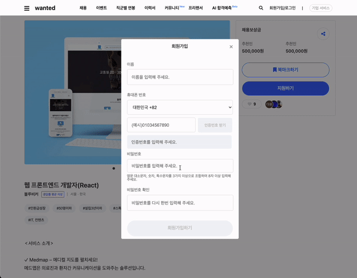

# 웹 개발(2주차)

## 22/10/11 ~ 22/10/14(1~4일차)

---

2주차 목표:

> 자바스크립트 기본 문법 & ES6 문법 익히기
> [모던자바스크립트](https://ko.javascript.info/) 참고

### 클론할 화면

---

### 구현한 화면

---

### 2주차 구현 내용

---

1. 메인페이지 접속시 3초간 스피너가 돌아가는 것을 구현하였습니다.
2. 채용 상세페이지를 작성하였습니다.
3. 로그인/회원가입 화면을 모달창으로 구현하였습니다.

### 학습한 내용

---

1. 모달창이라는 것에 대해 학습할 수 있었습니다. 모달창은 새로운 화면이 아니라 기본 화면에 display: none을 통해 숨겨놓았다가 버튼 이벤트가 발생하면 화면에 띄워주는 방식이라는 것을 알게 되었습니다.

### 아쉬운 점

---

1. 1주차에 부족했던 부분을 완성시키지 못했습니다.

   ex) slick-slider 버튼

2. 로그인 회원가입 모달창의 디테일한 기능을 아직 구현하지 못했습니다.

   ex) 이메일, 비밀번호 유효성 검사

3. 자바스크립트를 자유롭게 다루지는 못하는 것 같습니다.
