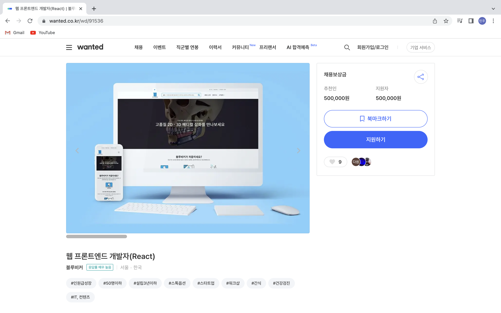
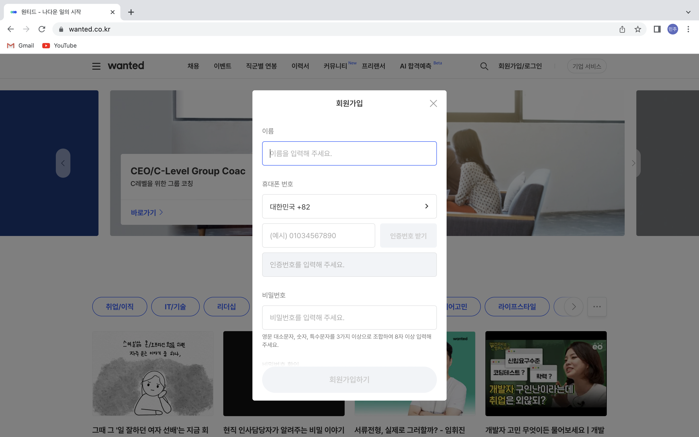

# 웹 개발(2주차)

---

## 22/10/11 ~ 22/10/14(1~4일차)

2주차 목표:

> 자바스크립트 기본 문법 & ES6 문법 익히기
> [모던자바스크립트](https://ko.javascript.info/) 참고

### 클론할 화면

---

### 구현한 화면

---

### 2주차 구현 내용

1. 메인페이지 접속시 3초간 스피너가 돌아가는 것을 구현하였습니다.
2. 채용 상세페이지를 작성하였습니다.
3. 로그인/회원가입 화면을 모달창으로 구현하였습니다.

### 아쉬운 점

1. 1주차에 부족했던 부분을 완성시키지 못했습니다.

   ex) slick-slider 버튼

2. 로그인 회원가입 모달창의 디테일한 기능을 아직 구현하지 못했습니다.

   ex) 전체 동의 체크하면 모든 체크박스 체크되는 기능, 이메일, 비밀번호 유효성 검사
