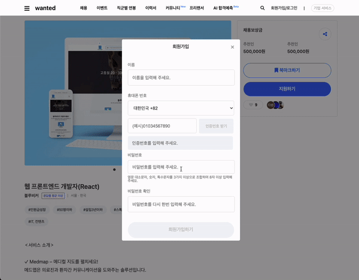

# 웹 개발(3주차)

---

## 22/10/17 ~ 22/10/21 (1~5일차)

## 3주차 목표:

> React 개념익히기, 기존 코드 리액트로 옮기기
> [벨로퍼트와 함께하는 모던 리액트](https://react.vlpt.us/basic/) 참고

### 3주차 구현 내용

---

1. 기존에 작성하였던 html 코드를 페이지 내에서 반복적으로 등장하는 부분을 component로 분해하였습니다.

2. 리액트용 슬릭 슬라이더를 적용하였습니다.

3. 자바스크립트에 보다 익숙해지기 위해 체크박스 전체동의, 모달창 끄기, 버튼 이벤트 등의 기능을 구현해보았습니다.

### 학습한 내용

---

1. 기존 코드를 component로 분해하는 과정을 통해 state와 props에 대한 개념을 학습할 수 있었습니다.

2. 리액트 프로젝트 안의 파일들의 역할과 구조에 대한 학습을 진행하였습니다. index.js 파일이 App.js 파일을 임포트하고 우리가 할 일은 App.js에 들어갈 컴포넌트들을 작성하는 것임을 알게되었습니다.

3. 리액트에서의 파일과 폴더 관리법에 대해 학습하였습니다. 파일들을 목적에 따라 pages, components, styles 폴더에 나누어주었습니다. [참고한 사이트](https://velog.io/@raverana96/react-%EB%A6%AC%EC%95%A1%ED%8A%B8-%ED%94%84%EB%A1%9C%EC%A0%9D%ED%8A%B8%EC%9D%98-%ED%8F%B4%EB%8D%94%EA%B5%AC%EC%A1%B0)

### 아쉬운 점

---

1. 아직 라우팅하는 방법을 배우지 않아 작성해놨던 여러 페이지를 확인하려면 기존 화면을 주석 처리하고 다른 화면 코드를 불러와야 한다는 점이 아쉬웠습니다.
2. 기존의 코드를 컴포넌트로 나누다보니 기존 html코드 보다 깔끔해진다는 장점은 알겠으나 아직까지 왜 꼭 리액트를 써야하는지 이해가 가지 않았습니다.

### 클론할 화면

---

기존에 만들었던 화면 컴포넌트로 분해하기

### 구현한 화면

---

