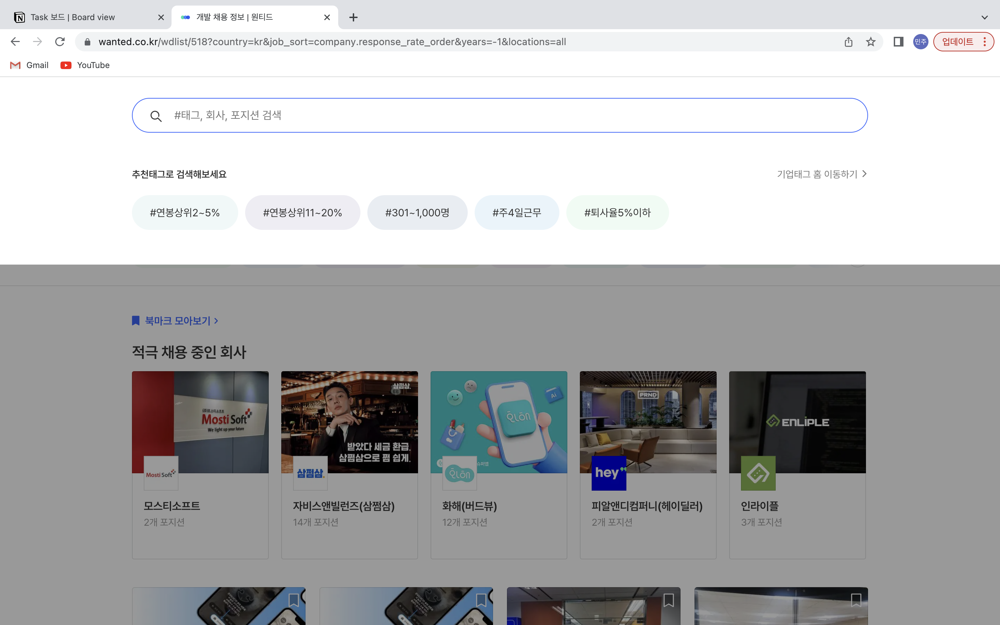
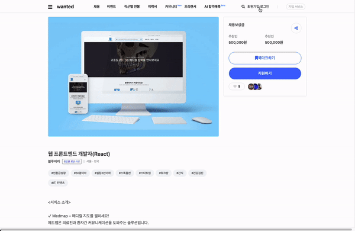
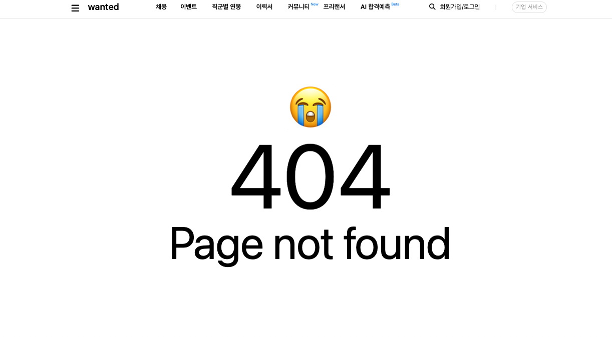
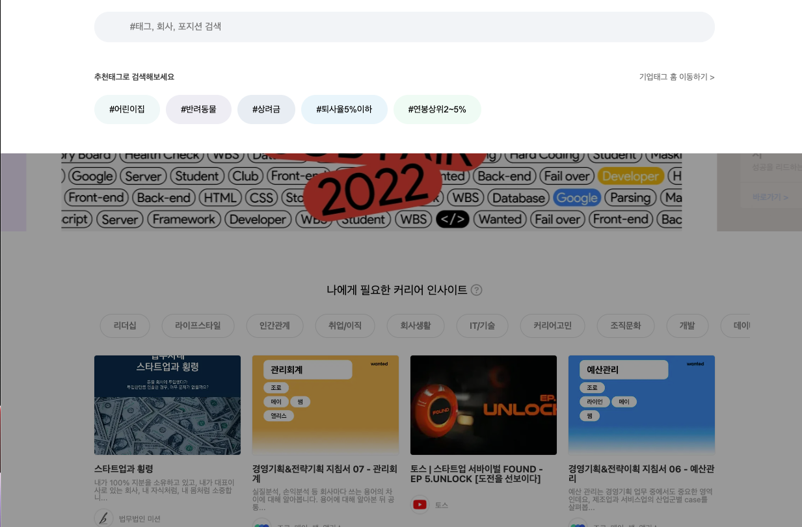
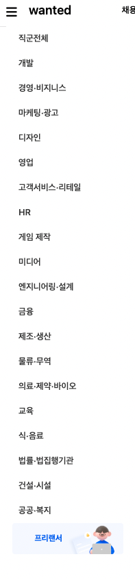

# 웹 개발(4주차)

---

## 22/10/24 ~ 22/10/28 (1~5일차)

4주차 목표:

> Routing을 이용하여 SPA 구현보기, JSON 파일 이용하여 더미데이터 작성하기

### 클론할 화면

---

기존 화면에 라우팅 기능 추가하기

검색 아이콘 눌렀을 때 화면

### 구현한 화면

---

### 4주차 구현 내용

---

1. react-router-dom을 이용하여 url에 따른 페이지 이동을 구현하였습니다.

2. 모달창 setState를 활용하여 리액트로 옮기는데 성공하였습니다.

3. 기존에 컴포넌트를 구성하던 더미 데이터들을 별개의 json 파일로 분리하여 map함수를 이용하여 컴포넌트에 뿌려주었습니다.

4. 준비되지 않은 url에 접근한 경우 잘못 접근했음을 알리는 페이지를 생성하였습니다.

5. 햄버거 바 메뉴를 생성하였습니다.

6. 상세 페이지 라우팅 구현(Link를 활용하여 게시물의 id별 라우팅을 구현하였습니다.)

### 학습한 내용

---

1. 모달창을 구현하며 state와 props 활용법을 좀 더 익히게 된 것 같습니다. 자식에게 setState 함수를 props로 전달하고 자식에서 state 상태를 변경하게하는 방법이 있다는 것을 알게 되었습니다.

2. react-router-dom의 사용법에 대해 익힐 수 있었습니다. 또한 SPA와 MPA의 차이점에 대해 학습할 수 있었고, SPA를 직접 구현해보며 SPA의 장점인 새로고침이 없다는 것이 사용자 경험을 개선시킨다는 점을 직접 경험해볼 수 있었습니다.

3. 더미 데이터를 map 함수를 이용하여 화면에 출력해봄으로써 map함수의 사용법을 익혀볼 수 있었습니다. 또한 직접 더미 데이터용 JSON 파일을 생성해보며 JSON 파일의 작성법을 배울 수 있었습니다.

4. 상세페이지의 id 값을 가져오기 위해 useParams를 사용하며 url 속의 값을 가져오는 방법에 대해 학습할 수 있었습니다.

5. 리액트에서 상태를 업데이트할 때는 기존 상태를 그대로 두면서 새로운 값을 상태로 설정해야함을 배웠습니다. 이를 불변성 유지라하는데 불변성 유지를 해줘야 나중에 리액트 컴포넌트의 성능을 최적화할 수 있다는 것을 알게되었습니다.

### 아쉬운 점

---

1. 페이지 이동 시 스크롤이 맨 위로 올라가지 않고 기존 자리에 위치한다는 문제가 있습니다.

2. 아직 쿼리스트링과 필터함수가 익숙치 않아 검색 기능을 구현하지 못했습니다.
