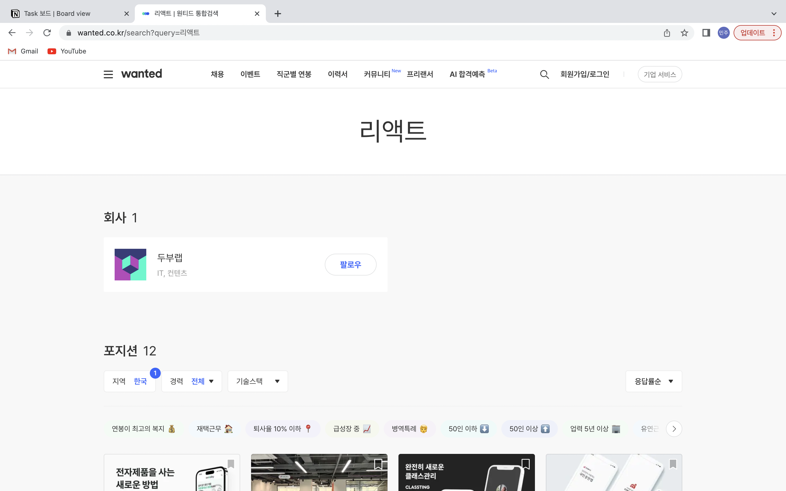
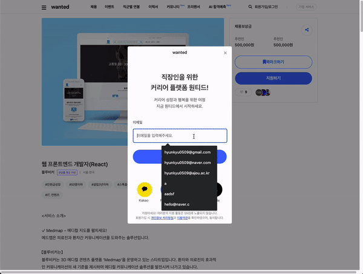
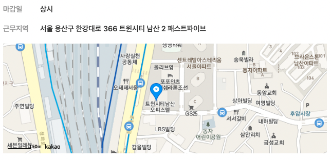
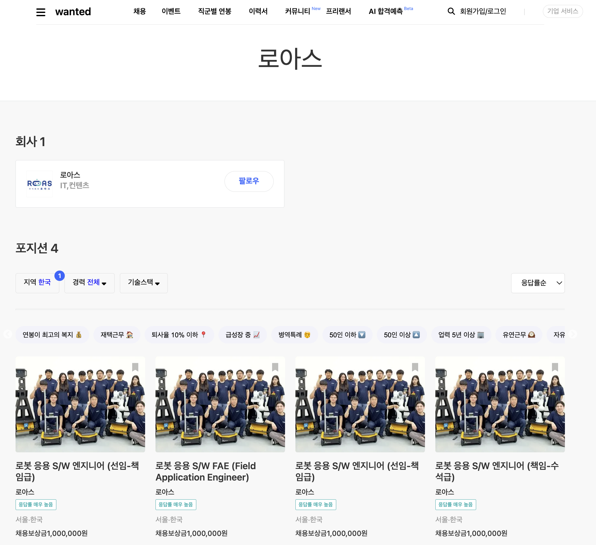
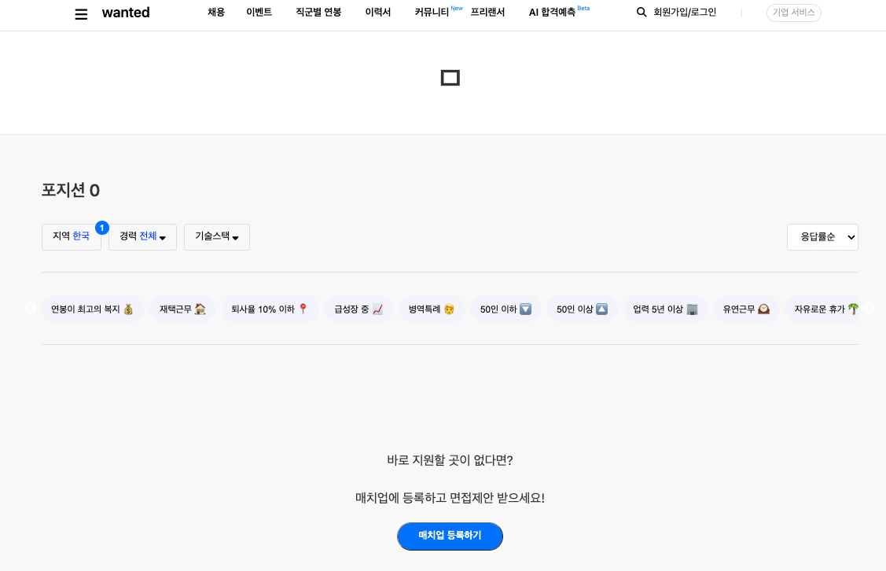

# 웹 개발(5주차)

---

## 22/10/31 ~ 22/11/4 (1~5일차)

5주차 목표:

> React Lifecycle과 Hook에 대한 학습

### 클론할 화면

---

### 구현한 화면

---

이메일 유효성 검사

카카오맵 api 연동

검색 성공 화면

검색 실패 화면

### 4주차 구현 내용

---

1. 정규표현식을 이용하여 이메일 유효성을 검사하였습니다.

2. 카카오맵 api를 연동하였습니다.

3. .env 파일을 이용하여 api 키를 숨겼습니다.

4. 전 주차에서 해결하지 못했던 문제인 스크롤을, 페이지 이동 시 스크롤이 맨 위로 올라 갈 수 있도록 수정하였습니다.

5. JobDetail 페이지를 좀 더 여러 개의 component로 분해하여 재사용성을 높였습니다. 각 component에 pageId를 넘겨주어 페이지에 따라 랜더링되는 화면이 변경되도록 구성하였습니다. 더미 데이터에 좀 더 많은 데이터를 넣어주었습니다.

6. 검색 기능을 구현하였습니다.

### 학습한 내용

---

1. filter나 map 함수는 새로운 배열을 반환한다는 사실을 오류로 통해 다시금 일깨우게 되었습니다.

2. useParams를 이용해 값을 가져올 때는 문자열로 가져오기에 숫자인 경우 숫자로 변환하는 과정이 필요함을 배웠습니다.

3. 검색 기능을 구현하기 위해 includes 함수 사용법을 익혔습니다.

4. useSearchParams 훅을 사용하면 URL의 복잡도가 높아졌을때 쿼리스트링을 쉽게 적용할 수 있게 해준다는 사실을 학습하였습니다.

5. 중복을 제거하기 위해 set을 이용하였습니다. list와는 다르게 set의 길이를 확인하기 위해서는 length가 아닌 size를 이용해줘야한다는 것을 배웠습니다. set에서는 map함수가 적용되지 않아 set 내부의 요소를 순회하기 위해서는 set을 다시 배열로 바꿔줄 필요하다는 것을 알게 되었습니다. set을 배열로 변경하기 위해서 Array.from() 함수를 이용해야 하는데 Array.from 함수는 유사배열객체나 반복 가능 객체를 얕은 복사하여 새로운 배열 객체로 만들어준다는 것을 알게 되었습니다.

### 아쉬운 점

---

1. 더미 데이터만을 이용해 화면을 띄우는게 아쉽다 느껴졌습니다. 직접 api 서버로 부터 데이터를 받아 화면을 구성하였다면 더 재미있었을 것 같습니다.

2. 정규 표현식이 아직 익숙치 않아 공부가 좀 더 필요할 것 같습니다.
