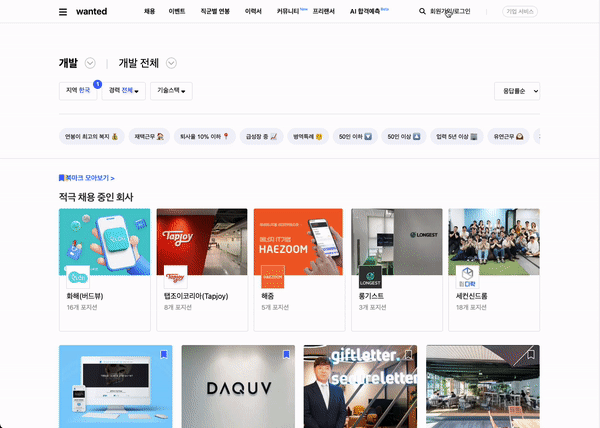
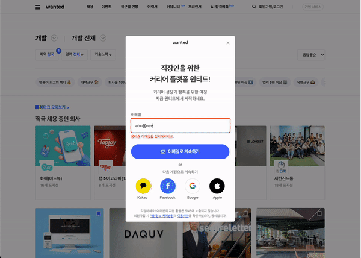
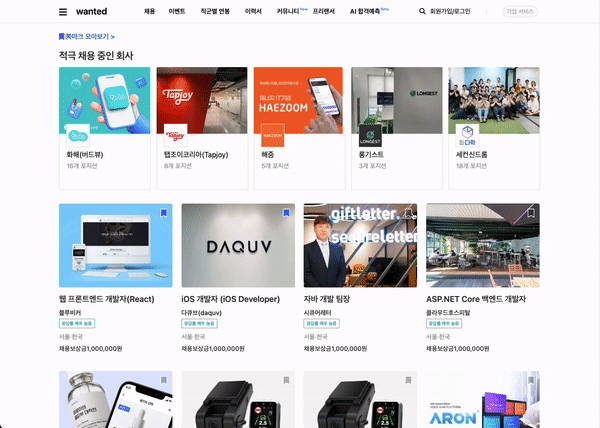

# 웹 개발(6주차)

---

## 22/11/7 ~ 22/11/11 (1~5일차)

## 6주차 목표:

> 상태관리 라이브러리 Redux에 대한 학습 및 적용

### 6주차 구현 내용

---

1. localStorage를 이용하여 로그인과 회원가입 기능을 구현하였습니다. 또한 이미 가입된 아이디인지를 판단하는 기능도 구현하였습니다.

2. 리덕스를 이용하여 북마크 기능을 구현하였습니다.

3. 리덕스를 이용하여 로그인과 로그와웃 상태를 구현하였습니다.

4. 회원가입 모달창의 인증번호 요청에 타이머 기능을 추가하였습니다.

5. 로그인 창이나 회원가입 창에 input tag와 유효성 검사가 반복되어 등장하여 useInput이라는 커스텀훅을 만들어 중복되는 코드를 줄였습니다.

6. 회원 가입 이후 등장하는 약관 동의 창 화면을 구현하였습니다.

### 학습한 내용

---

1. localStorage와 sessionStorage의 차이점에 대해 알게 되었습니다. 탭을 종료하더라도 회원가입에 대한 정보를 유지하기 위해 localStorage를 선택하여 아이디와 비밀번호, 가입된 이메일 주소들을 저장하였습니다.

2. 기존에 모달창을 구현하며 setState 값을 props로 자식들에게 계속해서 넘겨주며 불편하다 느꼈었는데, 이와 같은 문제를 리덕스를 통해 해결할 수 있음을 알게되었습니다.

3. 리덕스는 state 값을 변경할때 불변성을 유지해야한다는 특징을 알게되었습니다. state 불변성을 유지하며 객체 구조 분해할당 문법에 대해 공부할 수 있었습니다.

4. props를 전달하는 귀찮음을 해결해 줄 수 있는 방법으로 useContext라는 훅도 있다는 것을 알게되었습니다. Redux의 사용법이 useContext에 비해 더 어렵고 번거롭지만 북마크에는 Redux가 적합하다 생각하여 Redux를 선택하였습니다. 왜냐하면 context api의 경우 state 값이 변경된다면 provider로 감싸져 있는 모든 자식 컴포넌트들이 리렌더링 된다는 특징을 가지고 있어 북마크와 같이 상태 변경이 잦은 기능에는 Redux가 더 적합해보였기 떄문입니다.

5. 회원가입 창의 체크박스는 체크박스가 두 개뿐이라 전체 동의를 위한 로직을 각 체크박스마다 state를 배정하여 관리하였으나 약관 동의 창의 경우 체크박스가 3개이기에, 배열을 이용하여 하나의 state로 전체 동의 기능을 구현하는 로직을 작성해보았습니다.

### 아쉬운 점

---

1. 로컬스토리지에 비밀번호 값 자체를 암호화 없이 저장하다보니 보안을 유지하지 못한다는 점에서 아쉬움이 느껴졌습니다. 서버와 연결하여 비밀번호를 암호화 하는 기능이 필요하다고 느껴졌습니다.

2. 북마크 체크 여부를 화면에 표현하는 로직을 잘못 설계하여 리덕스를 사용했음에도 화면 다른 화면에서는 북마크가 유지되지 않는 문제가 발생하였습니다.

### 구현한 화면

---

로그인 및 로그아웃 구현

회원가입 후 자동 로그인 기능 구현

북마크 기능 구현
