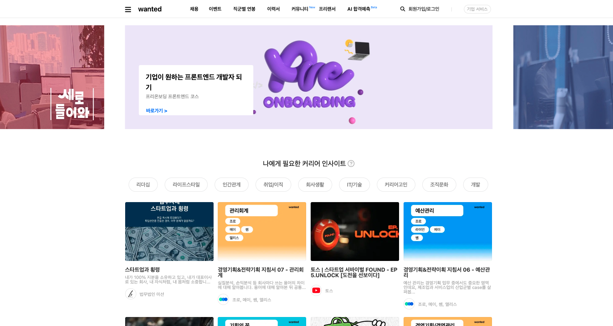

# [원티드 클론 코딩](https://qyupang.github.io/ASAC)

> [Wanted](https://www.wanted.co.kr/) 웹 사이트 클론 코딩을 진행하였습니다.

## 클론 코딩 기간

---

> 22/09/28 ~ 22/11/27

## 목표

---

웹 개발 경험을 쌓기 위해 원티드 웹 사이트 클론 코딩을 진행하였습니다. 매 주차마다 설정해놓은 개념들을 습득하고, 그 개념을 코드에 직접 구현하고자 노력하였습니다.

## 구현한 내용

---

1. 화면 구현
   - 메인 페이지, 채용공고 페이지, 채용상세 페이지, 북마크 모아보기, 검색화면, 회원가입, 로그인 화면, 반응형 화면
2. 기능 구현
   - 검색, 북마크, 로그인, 로그아웃, 기존&신규 고객 분류
3. 사용한 기술
   - html, css, javascript, react, styled-component, redux

## 배운점

---

정말 기초적인 부분부터 시작하여 새로운 기술들을 하나씩 쌓아 올리며, 새로 배운 기술이 기존에 구현한 방식을 어떻게 개선해줄 수 있는지를 직접 경험하며 배울 수 있었습니다.

1. html, css => react : 리액트를 이용하면 SPA를 쉽게 구현할 수 있고, 화면내에 반복되는 요소들을 컴포넌트로 분해하면 재사용성을 증가시킬 수 있음을 경험할 수 있었습니다.

2. props => redux : 상태관리 라이브러리인 redux를 활용하면 props 지옥에서 벗어날 수 있고, state를 전역적으로 사용할 수 있음을 배웠습니다.

3. css => styled-component : 기존에는 bem 방식을 이용해 각 태그들 마다 길게 이름을 붙여주어 중복을 방지했지만, styled-component를 통해 클래스 이름 지어줄 고민을 줄일 수 있었습니다.

## 주차별 진행 내용

---

### [1주차(10/4 ~ 10/7): 웹 개발 - HTML, CSS, JS](https://github.com/Qyupang/ASAC/tree/main/1week)

### [2주차(10/10 ~ 10/14): 웹 개발 - JS](https://github.com/Qyupang/ASAC/tree/main/2week)

### [3주차(10/17 ~ 10/21): 웹 개발 - React(기본지식)](https://github.com/Qyupang/ASAC/tree/main/3week)

### [4주차(10/24 ~ 10/28): 웹 개발 - React(SPA + Routing, JSON)](https://github.com/Qyupang/ASAC/tree/main/4week)

### [5주차(10/31 ~ 11/4): 웹 개발 - React(생명주기(Lifecycle), 훅)](https://github.com/Qyupang/ASAC/tree/main/5week)

### [6주차(11/7 ~ 11/11): 웹 개발 - React(상태관리 라이브러리 Redux)](https://github.com/Qyupang/ASAC/tree/main/6week)

### [7주차(11/14 ~ 11/18): 웹개발 - React(스타일드 컴포넌트, 반응형 웹)](https://github.com/Qyupang/ASAC/tree/main/7week)

### [8주차(11/21 ~ 11/27): 웹 개발 - 최종 마무리](https://github.com/Qyupang/ASAC/tree/main/8week)
